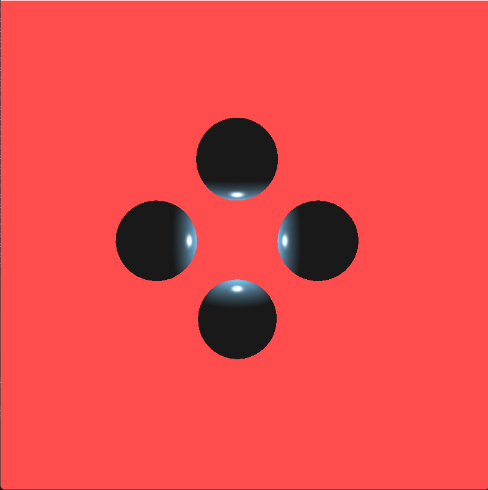
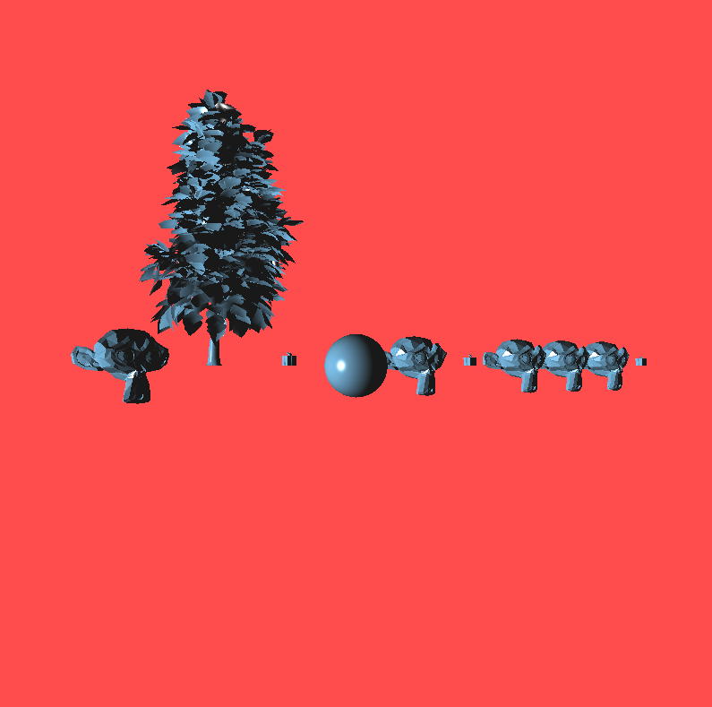
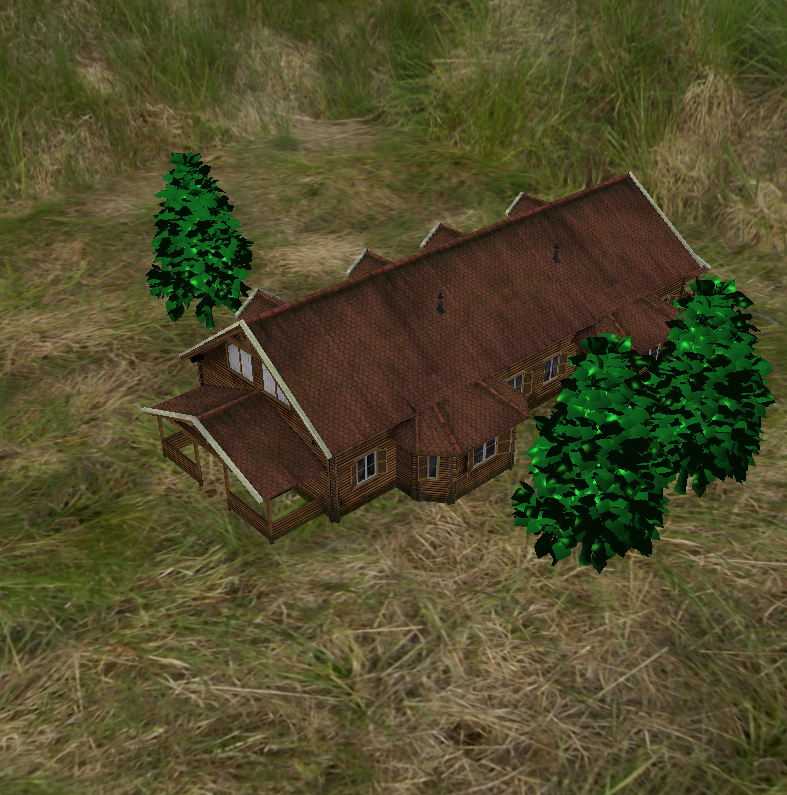
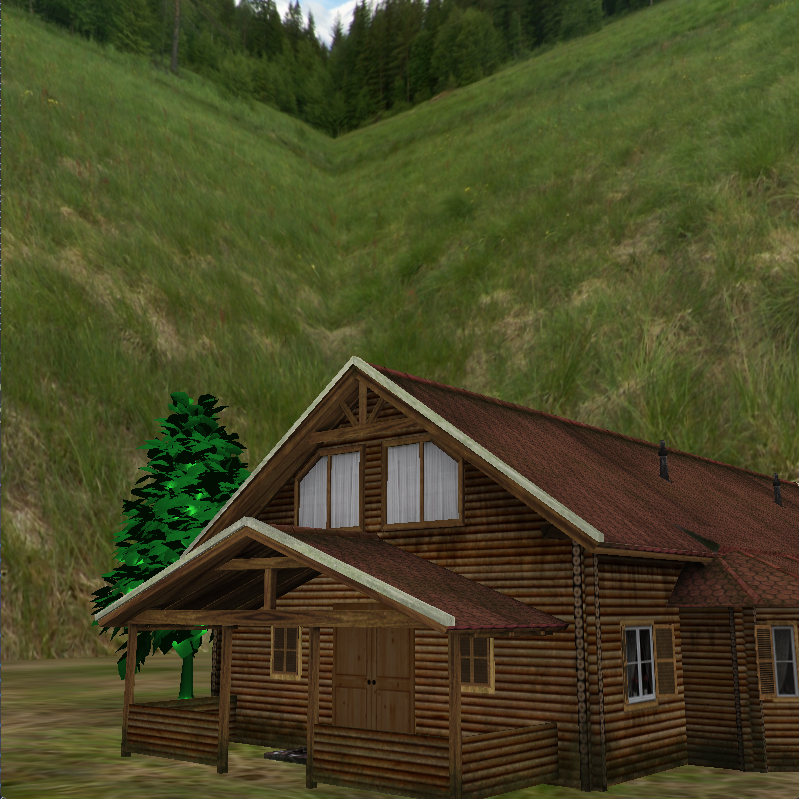

# OpenGL basic training
This project covers phong light, textures and adding assm. files.
## First scene - Phong Shader

## Second scene - Multi-objects

## Third scene - House Scene

### Controls 
- A-D keys right, left
- W-S keys zoom in, zoom out
- Q-E keys up, down
- R key to rest the scene
- Right Shift slow camera down
 